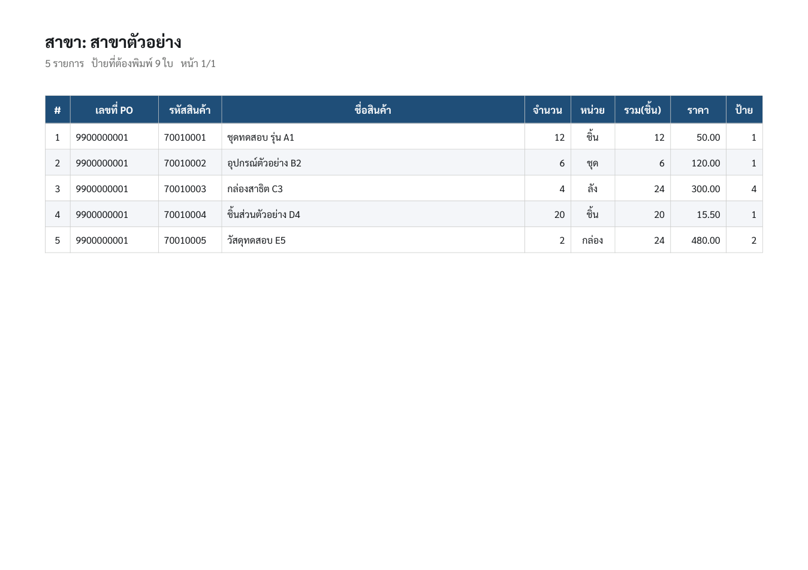
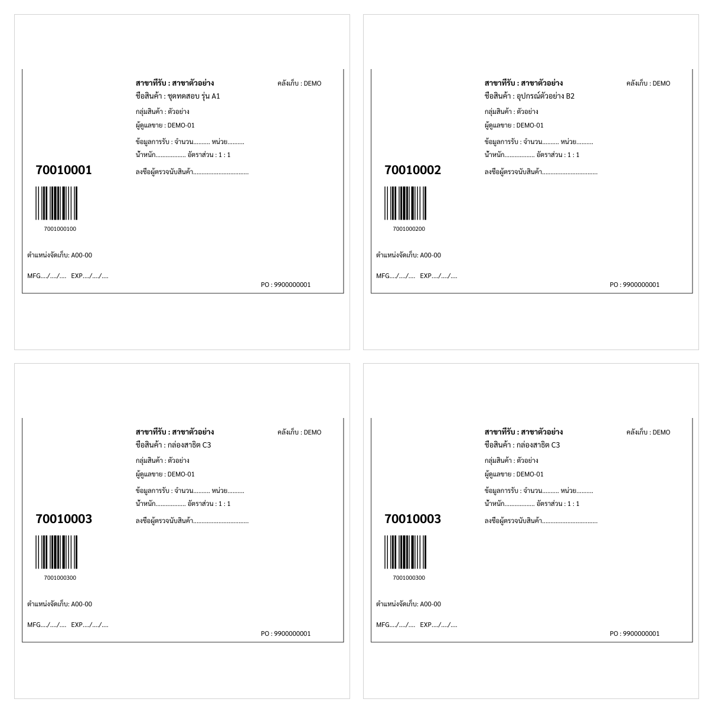

# purchase-order-pdf-packer

A small Windows tool that turns a supplier's bulky purchase-order PDFs into one compact PDF - an order summary grouped by receiving branch, plus only the receiving labels you actually need, each on its own sticker. It also saves an Excel copy of the line items.

It was built for a retail back office that received SAP-generated POs as 12+ page PDFs: one item per page, every page repeating the full header and terms, followed by separate label sheets. Staff re-typed the line items into Excel by hand and printed far more paper than they used. This collapses all of that into a couple of pages.

## What it does





- Reads the line items out of the PO - PO number, code, name, quantity, unit, price - and lays them out as one summary table per receiving branch, so each store's order stands on its own.
- Checks the extracted total against the PO's own printed subtotal and flags a mismatch, so a missed line never slips through unnoticed.
- Finds the receiving labels in the PDF, crops each one at full size, and prints only the copies you need - one label per 10 cm sticker, ordered by branch to match the summary. A plain item gets one label; an item ordered by the carton (a pack size in brackets, e.g. `ลัง(6)`) gets one label per carton.
- Writes an `.xlsx` copy of the line items next to the PDF.

## Download

Get `POPack.exe` from the [latest release](../../releases/latest). It is a single file - no installer, no runtime to set up.

## Usage

- Double-click `POPack.exe`, pick one or more PO PDFs, and choose where to save. A progress window shows the work and offers to open the result when it finishes.
- Or drag the PO PDFs straight onto the executable.

There is a fabricated sample (no real data) in `sample-POs/` to try it on.

## Build from source

Needs Go 1.26 or newer.

```
go build -o POPack.exe .
```

It cross-compiles to a standalone Windows binary from any OS:

```
CGO_ENABLED=0 GOOS=windows GOARCH=amd64 go build -ldflags "-s -w -H=windowsgui" -o POPack.exe .
```

CI builds and attaches `POPack.exe` to every tagged release.

## How it works

- **Reading the PDF.** SAP's output trips up most Go PDF libraries, so each file is first normalised with pdfcpu. The line items are then read positionally: text is grouped into rows by its Y position and split into columns by X. The label pages defeat the text interpreter (they carry inline images), so the product code is pulled straight out of the decoded content stream instead.
- **Placing labels.** Each label is cropped to its border box from the original page (which also drops the border line and the stray cut-marks bleeding in from the label below), then placed one per 10 cm sticker - scaled to fit with the barcode intact - in branch order to match the summary.
- **One file.** Everything, including the Thai font, is embedded, so the result is a single self-contained `.exe` with nothing to install. The summary table is drawn with tdewolff/canvas and the spreadsheet with excelize.

The first version was a Python script. It was rewritten in Go so the whole thing ships as one cross-compiled executable instead of asking each machine for a Python install.

## License

MIT - see [LICENSE](LICENSE). The bundled Sarabun font is under the SIL Open Font License; see [assets/OFL.txt](assets/OFL.txt).
